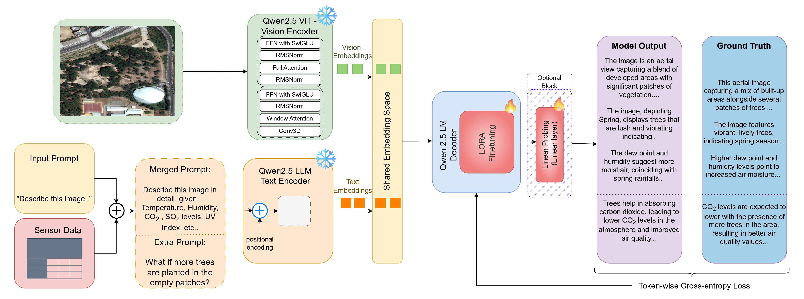

# ChatENV: An Interactive Vision-Language Model for Sensor-Guided Environmental Monitoring and Scenario Simulation 🌍

<div align="center">
  
  <a href="https://doi.org/10.1109/TGRS.2026.3685864"></a>&nbsp;&nbsp;
  [](https://arxiv.org/abs/2508.10635)&nbsp;&nbsp;
  
</div>

**ChatENV** is an IEEE TGRS 2026 paper, codebase, and dataset resource for **weather-aware temporal remote-sensing vision-language modeling**. Built on fMoW imagery, ChatENV supports temporal image-pair understanding, environmental monitoring, image captioning, change description, and sensor-guided “what-if” scenario reasoning. The released resources include cleaned annotations, generated captions/QA, weather- and emissions-related metadata sheets, model fine-tuning code for Qwen2.5-VL, and video-based baselines using Video-LLaVA and LLaVA-NeXT-Video. 

#### [Hosam Elgendy](https://scholar.google.com/citations?user=6RA4_m8AAAAJ&hl=en&oi=ao), [Ahmed Sharshar](https://scholar.google.com/citations?user=GC8A9k0AAAAJ&hl=en), [Ahmed Aboeitta](https://scholar.google.com/citations?user=sEZTgaYAAAAJ&hl=en&oi=ao) and [Mohsen Guizani](https://scholar.google.com/citations?user=RigrYkcAAAAJ&hl=en&oi=ao)
#### Mohamed bin Zayed University of Artificial Intelligence (MBZUAI)


---
<p align='center'>

</p>

---

## What is included?

ChatENV provides resources for researchers working on:

- **Temporal remote-sensing image understanding**
- **fMoW-based image-pair analysis**
- **Weather-aware and sensor-guided vision-language models**
- **Environmental monitoring with emissions / air-quality context**
- **Remote-sensing image captioning and change description**
- **What-if scenario simulation using visual and environmental metadata**


## Contents
- [Environment Setup](#environment-setup)
- [Dataset](#dataset)
- [Directoy Setup](#direcotry-setup)
- [Training](#training)
- [Evaluation](#evaluation)
- [Results](#results)
- [Acknowledgements](#acknowledgements)
- [Citation](#citation)

---

## Environment Setup

1. Clone this repository:
    ```shell
    git clone https://github.com/HosamGen/ChatENV.git
    cd ChatENV
    ```
> [!NOTE]
> This repo consists of the steps to finetune the Qwen 2.5 Model (named ChatENV), in addition to the setup to finetune Video-LLaVA and LLaVA-NeXT-Video (named videollava). The setup is split based on which model(s) is used.

2. Install the necessary dependencies:
    ```shell
    conda create -n chatenv python=3.10
    conda activate chatenv
    pip install -r chatenv_requirements.txt
    ```
2. [Optional] Setup for video models.
   ```shell
    conda create -n videollava python=3.10
    conda activate videollava
    pip install -r videollava_requirements.txt
    ```

---
## Dataset
### ChatENV Custom Dataset

1. fMoW Images: Please refer to the [fMoW dataset](https://github.com/fMoW/dataset?tab=readme-ov-file) for the original remote sensing dataset. Image files are needed for the ChatENV (Qwen based) model finetuning. We provide the cleaned annotations/QAs in the following steps.

2. Dataset for finetuning the Qwen model in the Three-Turn Setting, Sheet with Questions and Answers for the What-If finetuning, and Sheets with emissions data can be downloaded from: [ChatENV](https://mbzuaiac-my.sharepoint.com/:f:/g/personal/hosam_elgendy_mbzuai_ac_ae/ElUQBEmS821KsHf9WkisV4wBYNWru3K-gb2Lp7XNYsBrXQ?e=xVA7NS).

3. [OPTIONAL] For the video models, the annotations are too large, and can be downloaded via [Videollava-Annotations](https://mbzuaiac-my.sharepoint.com/:f:/g/personal/hosam_elgendy_mbzuai_ac_ae/ErvrSn_bdfJOkr8VOoF2oaIBRRmDECYP6_SFnBS_NAR6dw?e=RpEijA).
4. [OPTIONAL] For the video models, the videos of combined images can be downloaded as a zip file through: [Videollava-Videos](https://mbzuaiac-my.sharepoint.com/:u:/g/personal/hosam_elgendy_mbzuai_ac_ae/EcRuKZwN2y5AlNU3PTc36goBNfhlOdxtcWcZ35ZhiYFDXA?e=OIL0S2). These videos can be unzipped to two directories as follows:

```shell
unzip chatenv_videos.zip

|    ├── chatenv_train_videos/
|    ├── chatenv_val_videos/
```

## Direcotry Setup
The setup for the ChatENV directory should look like this:
```
ChatENV
├── annotations/
|    ├── chatgpt_train_annotations.json
|    ├── gemini_train_annotations.json
|    |   .....
├── chatenv_train_videos/
|    ├── xxx.mp4
|    |   .....
├── chatenv_val_videos/
|    ├── xxx.mp4
|    |   .....
├── llavanext_eval.py
├── llavanext_finetune.py
├── qwenvl/
├── videollava_finetune.py
├── videollava_test.py
...
```
The llavanext/videollava files are for the video based models, whereas `qwenvl/` contains the scripts for finetuing the qwen model.

The `qwenvl/` directory should look like:

```
ChatENV
├── qwenvl/
|    ├──chatgpt_eval_data
|    ├──chatgpt_train_data
|    ├──gemini_train_data
|    ├──gemini_eval_data
|    ├──...
|    ├──run_qwen_vl.py
|    ├──emissions_chatgpt.csv
|    ├──emissions_gemini.csv
|    ├──emissions_merge.csv

```
## Training

For the Qwen model finetuning, a single script `run_qwen_vl.py` does finetuning, zero-shot evaluation and fine-tuning evaluation. Simply use the following example and change it with the following flags:

```shell
python run_qwen_vl.py --model gemini  --mode eval --run_finetune
```

| Flag               | Description                                  | Possible Values / Type              |
|--------------------|----------------------------------------------|--------------------------------------|
| `--model`          | Selects the base model to use                | `gemini`, `chatgpt`, `merge`         |
| `--linear`         | Enables linear probing instead of full fine-tuning | *(flag, no value needed)*            |
| `--train_samples`  | Number of training samples to use            | Integer (e.g., `35000`)              |
| `--eval_samples`   | Number of evaluation samples to use          | Integer (e.g., `2000`)               |
| `--mode`           | Selects the run mode                         | `eval`, `whatif`                     |
| `--run_zero_shot`  | Run zero-shot evaluation                     | *(flag, no value needed)*            |
| `--run_finetune`   | Run fine-tuning and evaluation               | *(flag, no value needed)*            |


As for the video models, run the `videollava_finetune.py` or `llavanext_finetune.py` scripts, change the flags based on your configuration.

For Video-LLaVA:
```shell
python videollava_finetune.py
```

For LLaVA-NeXT:
```shell
python llavanext_finetune.py
```

Flags:

| Flag             | Description                                                  | Possible Values / Type                               | Default   |
|------------------|--------------------------------------------------------------|------------------------------------------------------|-----------|
| `--use_lora`     | Enable LoRA                                                   | *(flag, no value needed)*                           | `False`   |
| `--use_qlora`    | Enable QLoRA (takes priority over LoRA)                       | *(flag, no value needed)*                           | `True`    |
| `--use_8bit`     | Use 8-bit configuration with QLoRA                            | *(flag, no value needed)*                           | `False`   |
| `--use_linear`   | Use Linear Probing                                            | *(flag, no value needed)*                           | `False`   |
| `--model_type`   | Specify the model type                                        | (`sample`, `full`)                                  | `full`    |
| `--batch_size`   | Batch size for processing                                     | Integer                                             | `3`       |
| `--epochs`       | Number of epochs for finetuning the model                     | Integer                                             | `1`       |
| `--lora_r`       | LoRA rank parameter                                           | Integer                                             | `64`      |
| `--lora_alpha`   | LoRA alpha parameter                                          | Integer                                             | `128`     |
| `--model`        | Specify the model used                                        | `chatgpt`, `gemini`, `merge`                        | `chatgpt` |


## Evaluation

For the Qwen model finetuning, the same script `run_qwen_vl.py` is used:
Zero-Shot Evaluation:
```shell
python run_qwen_vl.py --model gemini  --mode eval --run_zero_shot
```

Finetuning Evaluation:
```shell
python run_qwen_vl.py --model gemini  --mode eval --run_finetune
```

To evaluate the fine-tuned models on the test dataset, use the following commands:

For Video-LLaVA:
```shell
python videollava_eval.py --model gemini --model_path [path to the finetuned model]
```

For LLaVA-NeXT:
```shell
python llavanext_eval.py --model gemini --model_path [path to the finetuned model]
```

> [!IMPORTANT]
> The MODEL_PATH must be changed during evaluation based on the model that was finetuned.


## Results

The previous scripts will run the evaluation on the specified test dataset and generate performance metrics, including ROUGE, , SBERT, COMET, and BERT scores. The results will help assess the model's performance in detecting temporal changes in remote sensing data. The fine-tuned model demonstrated significant improvements in capturing and describing temporal changes in geographical landscapes compared to the non-trained model. 

To calculate the scores (for Video-LLaVA and LLaVA-NeXT-Video models) after evaluating, please use the [eval_updated.py](https://github.com/HosamGen/ChatENV/blob/main/eval_updated.py) script to get the scores. The Qwen VL model script does this step internally. 
Additional score introduced in this paper is the Keyword Cluster Evaluation (KCE) metric, which is done through the [keyword_eval.py](https://github.com/HosamGen/ChatENV/blob/main/keyword_eval.py) python script.

### ChatENV Three Turn Setting Results

| Annotations          | Training   | ROUGE-L   | SBERT     | BERT-F1   | COMET     | KCE-F1    |
| -------------------- | ---------- | --------- | --------- | --------- | --------- | --------- |
| **ChatGPT**          | Base       | 0.124     | 0.430     | 0.824     | 0.496     | 0.710     |
|                      | LoRA       | 0.242     | 0.702     | 0.889     | 0.733     | 0.818     |
|                      | Lin. PROBE | 0.233     | 0.648     | 0.884     | 0.699     | 0.817     |
| **Gemini**           | Base       | 0.122     | 0.450     | 0.825     | 0.490     | 0.692     |
|                      | LoRA       | 🔸0.298🔸 | 🔸0.803🔸 | 🔸0.902🔸 | 🔸0.763🔸 | 0.826     |
|                      | Lin. PROBE | 0.289     | 0.794     | 0.899     | 0.752     | 🔸0.830🔸 |
| **ChatGPT + Gemini** | Base       | 0.124     | 0.445     | 0.825     | 0.495     | 0.705     |
|                      | LoRA       | 0.250     | 0.737     | 0.890     | 0.745     | 0.814     |
|                      | Lin. PROBE | 0.236     | 0.706     | 0.883     | 0.713     | 0.809     |


### ChatENV Two Turn Setting (What-If) Results

| Annotations          | Training   | ROUGE-L   | SBERT     | BERT-F1   | COMET     | KCE-F1    |
| -------------------- | ---------- | --------- | --------- | --------- | --------- | --------- |
| **ChatGPT**          | Base       | 0.108     | 0.607 | 0.840     | 0.627     | 0.587     |
|                      | LoRA       | 0.231     | 0.597     | 0.893 | 0.686 | 0.800     |
|                      | Lin. PROBE | 0.233 | 0.596     | 0.889     | 0.684     | 0.813 |
| **Gemini**           | Base       | 0.115     | 0.597     | 0.837     | 0.626     | 0.569     |
|                      | LoRA       | 🔸0.282🔸 | 🔸0.667🔸 | 🔸0.900🔸 | 🔸0.705🔸 | 🔸0.816🔸 |
|                      | Lin. PROBE | 0.247     | 0.647     | 0.889     | 0.702     | 0.759     |
| **ChatGPT + Gemini** | Base       | 0.111     | 0.603     | 0.838     | 0.628     | 0.576     |
|                      | LoRA       | 0.254     | 0.646     | 0.895     | 0.695     | 0.809     |
|                      | Lin. PROBE | 0.234     | 0.629     | 0.886     | 0.666     | 0.785     |


These metrics illustrate how well the models performed in describing temporal changes in remote sensing data, with fine-tuning techniques like LoRA based on the different conversation settings.

## Acknowledgements
+ [Qwen-2.5VL](https://github.com/QwenLM/Qwen2.5-VL) Original repo for the Qwen2.5-VL model.
+ [Video-LLaVA](https://github.com/PKU-YuanGroup/Video-LLaVA/) Video-LLaVA: Learning United Visual Representation by Alignment Before Projection. We have used Video-LLaVA as one of the models for finetuning.
+ [LLaVA-NeXT](https://github.com/LLaVA-VL/LLaVA-NeXT) LLaVA-NeXT: Open Large Multimodal Models. The video model was used as the second model.
+ [fMoW RGB Dataset](https://github.com/fMoW/dataset) Original fMoW dataset repo.

## Citation
please cite using this BibTeX:
```bibtex
@ARTICLE{11488610,
  author={Elgendy, Hosam and Sharshar, Ahmed and Aboeitta, Ahmed and Guizani, Mohsen},
  journal={IEEE Transactions on Geoscience and Remote Sensing}, 
  title={ChatENV: An Interactive Vision–Language Model for Sensor-Guided Environmental Monitoring and Scenario Simulation}, 
  year={2026},
  volume={64},
  number={},
  pages={4703710-4703710},
  keywords={Satellite images;Earth Observing System;Landsat;Sentinel-2;Feeds;Filtering;Filters;Circuits and systems;LoRa;Videos;Environmental monitoring;remote sensing;scenario prediction;vision–language models},
  doi={10.1109/TGRS.2026.3685864}}
```


